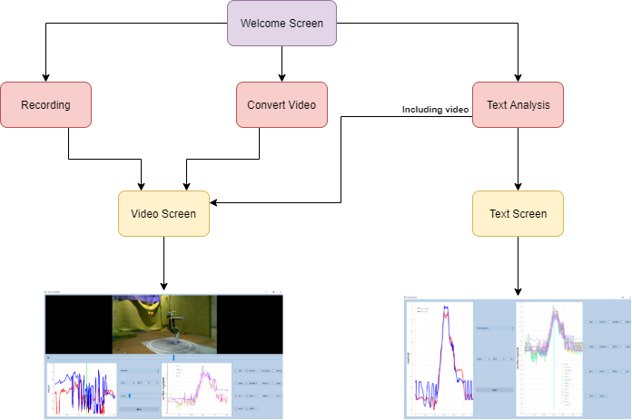

# My Digital Drone Twin
### Skeleton-Tracking for Sports using LiDAR Depth Camera
:walking:   :helicopter:   :running:

Find project's website [here.](https://www.kth.se/profile/marjacob/page/my-digital-drone-twin)

# How SkeletonTrackingApp works?
Are you curious to find out how `SkeletonTrackingApp` works?

Watch or download the promotional video [here.](https://drive.google.com/file/d/1jBj1NEGkHDlKoi4hIVkaVtir5x2B-z0S/view?usp=sharing)

`SkeletonTrackingApp` is a software prototype.

# Information
- Read some simple instructions on welcome screen, when you run the app.
- After `Recording` the recorded video is saved on your desktop automatically.
- After `Convert video` a text file with all joints and their respective 3D positions is saved on your desktop automatically.
- Video is not required for `Text analysis`. 
- 3D joints' positions are the `points coordinates` in meters.
- Potential `NaN values` are filled, initially, utilizing `linear interpolate [pad/forward]` method and then applying `backfill` method.
- `Moving average` is the default filter. Versions of `kalman filter` and `butterworth` can be found [here.](https://github.com/pan-efs/My-Digital-Drone-Twin/tree/main/filters) 
- Default values are `depth`: 1024x768, `color`: 1280x720 and `fps=30` during streaming.

# Simplified diagram

# Prep
- The project has been built with `python=3.7.9` version on `Windows 10 OS`.
- You must have `python3` and the version to be `< 3.8` due to Cubemos restrictions.
- You need an Intel RealSense camera `L515` if you intend to use the functionaly `Recording`. `D400` serie should work as well.

# Miniconda installation
To install `miniconda` you can follow [the instructions of official website](https://docs.conda.io/en/latest/miniconda.html).

# Conda environment
You need to create a new `conda` environment with all the essential `python` packages installed. You can create this environment from the provided `environment.yml` file in this repository in the following way:
- `conda env create -f environment.yml`

Also, you can install `requirements` using the command.
- `pip install -r requirements.txt`

# Cubemos
You can follow the install instructions related to `Cubemos Skeleton Tracking` from [getting started guide](https://download-skeleton-tracking-sdk.s3.eu-central-1.amazonaws.com/GettingStartedGuide.pdf) or [realsense installation guide](https://dev.intelrealsense.com/docs/skeleton-tracking-sdk-installation-guide).

# VS Code
`VS Code` is recommended but it's not necessary.

Read this [official tutorial](https://code.visualstudio.com/docs/editor/github) related to GitHub and Visual Studio Code. For instance, how can you clone a repository...and so on!

# Run the app via command
Use the below command to run the app. `-W ignore` flag ignores useless warnings which are popped up.

`cd app`

`python -W ignore run_gui.py`
# Run unittests
`cd test`, and then use the command `pytest`.
